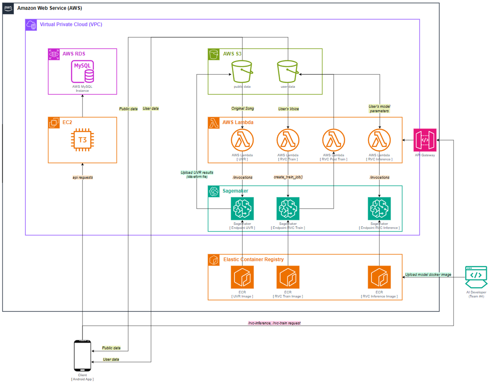

<div align="center">

# singtome: AI models

*singtome 프로젝트에서 사용된 ai model들에 대해 소개하는 프로젝트*

[](#) [](#) [](https://hits.seeyoufarm.com)

</div>

<br>

안녕하세요, 방문해 주셔서 감사합니다. 이 GitHub 레포지토리는 singtome 프로젝트에서 사용된 모델의 구현 코드를 담고 있습니다. singtome 프로젝트에 대해 더 알고 싶으시다면, [이 링크](#)를 참조해 주세요. 본 프로젝트에서는 음악의 보컬 변환 기능을 구현하기 위해 RVC 모델을 사용하였으며, 모델의 핵심 구현체는 [이곳](https://github.com/RVC-Project/Retrieval-based-Voice-Conversion-WebUI)에서 확인하실 수 있습니다. RVC 모델의 사용 방법과 원리에 대한 더 자세한 정보는 연결된 RVC 레포지토리를 참고하시기 바랍니다.

<br>

<div align="center">

<h3> Model part Team members </h3>

| Profile | Name | GitHub | Role |
| :---: | :---: | :---: | :---: |
|  | Jongmoon Ryu <br> **moon**| <a href="https://github.com/Orca0917"> <div style="display: flex; align-items: center;">  &nbsp; Orca0917 </div> </a> | 모델 파이프라인 및 아키텍처 설계 <br> RVC 모델 학습 및 추론용 도커 이미지 생성 <br> AWS Sagemaker 전반적인 관리 및 운용 |
|  | Heechan Chung <br> **anselmo**| <a href="https://github.com/anselmo228"> <div style="display: flex; align-items: center;">  &nbsp; anselmo228 </div> </a> | UVR 모델의 추론용 도커 이미지 생성 <br> AWS S3 버킷 및 Lambda, API gateway 관리 <br> singtome 프로젝트 모델 실험 관리|

<br>

<h3> Skills </h3>


</div>

<br>

## 1. Pipeline

이 프로젝트에서는 원곡을 특정 사용자의 목소리로 변환하는 복잡한 과정을 구현했습니다. 이를 위해 우리는 두 가지 주요 모델을 활용했습니다:

1. **UVR (Ultimate Vocal Remover)**: 이 모델은 음악에서 배경음악(MR)과 보컬을 분리하는 역할을 합니다. UVR은 사전 학습된(pretrained) 모델을 기반으로 하며, 이를 통해 고품질의 음악과 보컬 분리를 실현합니다.
2. **RVC (Retrieval Voice Conversion)**: 이 모델은 분리된 보컬을 특정 사용자의 목소리로 변환하는 작업을 담당합니다. RVC는 각 사용자의 목소리 특성을 학습하고, 이를 실제 음악에 적용하여 최종 출력을 생성합니다.

<br>

이 두 모델을 통해, 원곡을 받아 사용자의 목소리로 변환하는 전체 과정을 아래와 같이 구현하였습니다:

1. **음악 분리**: UVR 모델을 사용하여 원곡에서 배경음악과 보컬을 분리합니다.
2. **목소리 변환**: 분리된 보컬을 RVC 모델에 입력하여 특정 사용자의 목소리로 변환합니다.
3. **출력 생성**: 변환된 목소리를 배경음악과 합쳐 최종 출력을 생성합니다.

<br>

이 과정을 통해, 사용자는 자신의 목소리로 변환된 음악을 경험할 수 있으며, 이는 음악 감상에 새로운 차원을 더하는 혁신적인 접근입니다. 이 아키텍처는 복잡한 과정을 명확하게 이해할 수 있도록 돕기 위해 설계되었습니다.


<br>

## 2. Architecture

이 프로젝트는 실제 서비스 환경을 고려하여 설계되었으며, 모든 학습과 추론 작업을 클라우드에서 처리할 수 있도록 AWS (Amazon Web Services)를 선택했습니다. AWS의 강력한 클라우드 인프라를 활용하여, 모델 학습과 추론을 위한 다음과 같은 서비스를 사용하였습니다:

1. **Amazon SageMaker**: 모델 학습을 위해 SageMaker를 사용했습니다. SageMaker는 머신 러닝 모델을 쉽고 빠르게 구축, 학습시키고, 배포할 수 있는 완전 관리형 서비스를 제공합니다.
2. **AWS Lambda**: 학습 및 추론을 위한 트리거(trigger) 기능으로 Lambda 함수를 사용하였습니다. Lambda는 서버를 관리하지 않고도 코드를 실행할 수 있게 해주는 이벤트 기반 컴퓨팅 서비스입니다.

<br>

이 프로젝트의 클라우드 기반 워크플로우는 대략적으로 다음과 같은 과정을 포함합니다:

1. **사용자 요청 수신**: 사용자로부터 원곡 변환 요청을 받습니다.
2. **Lambda 트리거 활성화**: 요청을 처리하기 위해 AWS Lambda 함수가 트리거됩니다.
3. **SageMaker에서 모델 학습 및 추론**: Lambda 함수는 Amazon SageMaker를 호출하여 모델 학습과 추론 작업을 진행합니다.
4. **결과 반환**: 변환된 음악 파일을 사용자에게 반환합니다.

<br>

이 아키텍처는 클라우드의 유연성과 확장성을 최대한 활용하여, 고품질의 사용자 경험을 제공하도록 설계되었습니다. 사용자의 요청에 따라 모델 학습과 추론이 자동으로 진행되며, 이 모든 과정은 클라우드 서비스를 통해 관리됩니다.



<br>

## 3. How does it work?

프로젝트의 모델 파트는 AWS에서 제공하는 다양한 서비스를 활용하여 구현되었습니다. 이 구조는 클라우드 환경에서의 높은 확장성과 유연성을 제공합니다. 구현의 주요 특징과 과정은 다음과 같습니다:

1. **API Gateway**: 모든 요청은 AWS의 API Gateway를 통해 받습니다. API Gateway는 사용자의 요청을 적절한 리소스로 라우팅하는 역할을 하며, 보안, 모니터링, 사용량 관리 등을 제공합니다.

2. **Amazon SageMaker**: API Gateway로부터 요청을 받으면, Amazon에서는 자동으로 SageMaker 인스턴스를 할당하여 모델의 학습이나 추론 작업을 수행합니다. SageMaker는 머신 러닝 모델을 쉽게 구축, 학습, 배포할 수 있는 완전 관리형 서비스입니다.

3. **S3 버킷 저장**: 학습된 모델 파라미터나 추론 결과(음성 파일)는 Amazon S3 버킷에 저장됩니다. 사용자는 이 버킷에 접근하여 필요한 데이터를 다운로드할 수 있습니다.

4. **Spring Boot 백엔드**: 백엔드 정보 관리(사용자 정보, 등록 정보 등)는 Spring Boot를 사용한 백엔드 파트에서 관리됩니다. 이를 통해 프론트엔드와 분리된 안정적인 데이터 관리가 가능합니다.

5. **Docker와 ECR**: 커스텀 모델을 Amazon SageMaker에서 사용하기 위해, Docker 이미지를 Amazon Elastic Container Registry(ECR)에 업로드하고 SageMaker에서 이를 불러오는 방식을 채택했습니다. 이 방법은 모델 관리를 보다 효과적으로 하고, 입력 및 출력 형태가 동일할 경우 모델 구현 부분을 쉽게 수정할 수 있는 큰 장점을 제공합니다.

이 구조는 AWS의 강력한 클라우드 기능을 통해 고성능, 확장 가능한 애플리케이션 구축을 가능하게 합니다. 추가로 필요한 dependency와 환경 설정에 대한 자세한 정보가 아래 섹션에서 제공됩니다.


<br>

## 4. Environment

모든 작업은 docker 환경위에서 이루어졌습니다. 그렇기 때문에 각 이미지에서 필요한 requirements 및 base image 정보는 각 `dockerfile`을 참고해주시기 바랍니다. 학습에 사용된 로컬 GPU 및 클라우드 인스턴스 정보는 다음과 같습니다.

- LOCAL GPU: NVIDIA RTX 4090 x 2
- CLOUD INSTANCE: AWS g4dn.xlarge

### 4.1. RVC-train

[🐳 Goto Dockerfile]()

### 4.2. RVC-inference

[🐳 Goto Dockerfile]()

### 4.3. UVR-inference

[🐳 Goto Dockerfile]()

<br>

### 4.4. Etc.

여기서는 학습 및 추론과정에서 필요한 pretrained 파일의 다운로드 방법에 대해서 소개합니다. 저희가 필요한 pretrained 파라미터 파일은 총 2개로 아래와 같습니다. 정확한 음성처리를 위해 필요한 라이브러리로 `ffmpeg.exe`, `ffprobe.exe` 를 함께 준비해줘야 합니다.

> [HuggingFace-1](https://huggingface.co/lj1995/VoiceConversionWebUI/tree/main/pretrained_v2)에서 2가지 파일을 다운로드 - RVC-model/pretrained_v2 내에 이동
> - `f0D48k.pth`
> - `f0G48k.pth`

> [HuggingFace-2](https://huggingface.co/lj1995/VoiceConversionWebUI/tree/main)에서 2가지 파일을 다운로드 - RVC-model의 최상단에 위치하도록 이동
> - `ffmepg.exe`
> - `ffprobe.exe`

<br/>

### 4.5. Setting parameters

`@rvc-train.py`
- trainset_dir4 : 학습에 사용될 데이터셋이 존재하는 폴더를 지정
- exp_dir1 : 학습의 실험 이름을 설정

```commandline
python rvc-train.py
```

<br>

`@rvc-infer.py`
- sid0 : weights 폴더내에 실험이름으로 지정되어 있는 pth파일을 선택
- input_audio0 : 추론에 사용할 원본 음악 (vocal file)을 선택
- file_index2 : logs/{exp_dir1}/ 내에 존재하는 added_*.pth 파일을 선택

```commandline
python rvc-infer.py
```

<br/>

## 5. Reference

- [Retrieval-based-Voice-Conversion-WebUI](https://github.com/RVC-Project/Retrieval-based-Voice-Conversion-WebUI)
