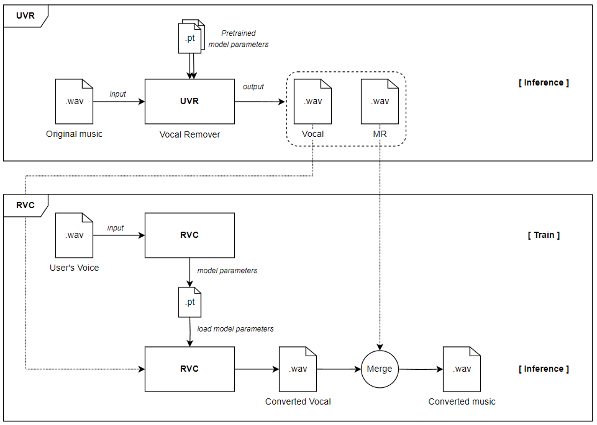
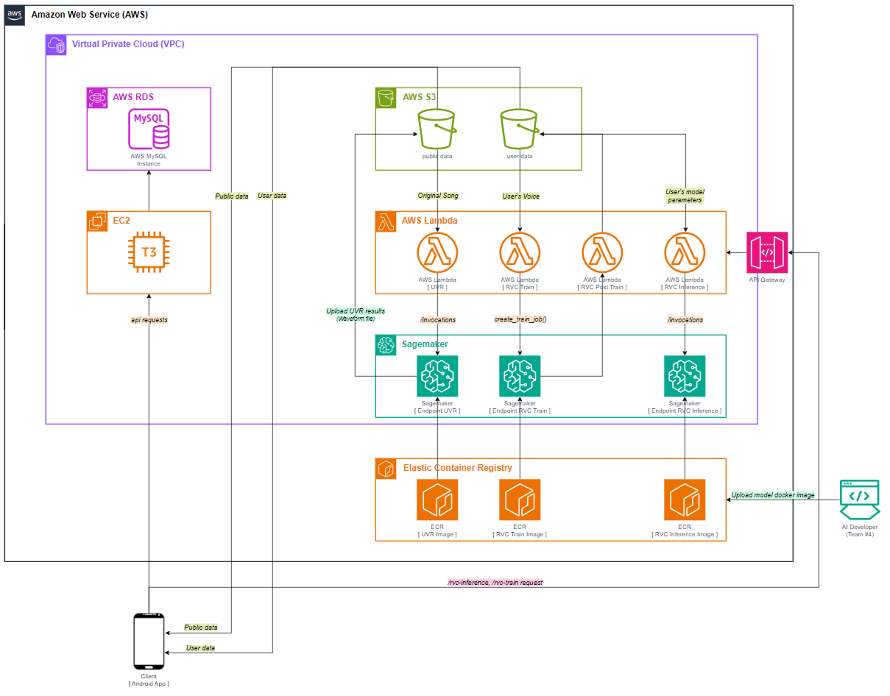
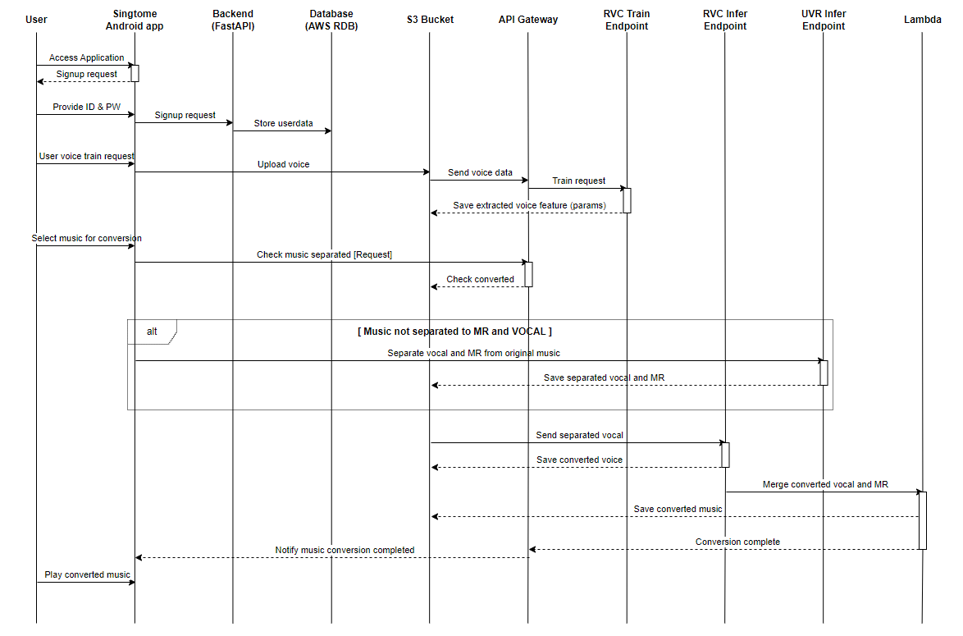

<div align="center">

# singtome: AI models

*introducing the AI models used in the SINGTOME project.*

[](./README.md) [](./README-KR.md) [](https://hits.seeyoufarm.com)

</div>

<br>

Hello, and thank you for visiting. This GitHub repository contains the implementation code for the model used in the singtome project. If you're interested in learning more about the singtome project, please refer to [this link](#). The project utilizes the RVC (Retrieval Voice Conversion) model to implement vocal transformation features in music. You can find the core implementation of the model [here](https://github.com/RVC-Project/Retrieval-based-Voice-Conversion-WebUI). For more detailed information on how to use the RVC model and its principles, please consult the linked RVC repository.

<br>

<div align="center">

<h3> Model part Team members </h3>

| Profile | Name | Role |
| :---: | :---: | :---: |
| <a href="https://github.com/Orca0917"></a>| Jongmoon Ryu <br> **moon**| Model Pipeline and Architecture Design <br> Creating a Docker Image for RVC Model training and inference<br> Managing and Operating AWS SageMaker |
| <a href="https://github.com/anselmo228"></a> | Heechan Chung <br> **anselmo**| Create a Docker Image for Inferring UVR Models <br> Manage AWS S3 buckets, Lambda, and API gateways <br> Managing singtome project model experiments|

<br>

<h3> Skills </h3>


</div>

<br>

## 1. Pipeline


In this project, we've implemented a complex process to transform original music tracks into a specific user's voice. To achieve this, we utilized two main models:

1. **UVR (Ultimate Vocal Remover)**: This model separates the background music (MR) and vocals in a music track. Based on a pretrained model, UVR achieves high-quality separation of music and vocals.
2. **RVC (Retrieval Voice Conversion)**: This model is responsible for converting the separated vocals into a specific user's voice. RVC learns the characteristics of a user's voice and applies this to the actual music to create the final output.

<br>

Through these two models, the entire process of converting an original track into the user's voice is implemented as follows:

1. **Music Separation**: The UVR model is used to separate the background music and vocals from the original track.
2. **Voice Conversion**: The separated vocals are input into the RVC model to be converted into a specific user's voice.
3. **Output Generation**: The converted voice is combined with the background music to create the final output.

<br>

This process allows users to experience music converted into their own voice, adding a new dimension to music appreciation. This architecture is designed to clearly understand the complex process involved.



<br>

## 2. Architecture

This project was designed with a real-service environment in mind and selected AWS (Amazon Web Services) to handle all training and inference tasks in the cloud. Utilizing AWS's robust cloud infrastructure, the following services were employed for model training and inference:

1. **Amazon SageMaker**: Used for model training, SageMaker is a fully managed service that allows for the easy and quick construction, training, and deployment of machine learning models.
2. **AWS Lambda**: Employed as a trigger for training and inference tasks, Lambda is an event-driven computing service that runs code without managing servers.

<br>

The cloud-based workflow of this project generally involves the following steps:

1. **Receiving User Requests**: Receives requests for original music conversion from users.
2. **Activating Lambda Triggers**: An AWS Lambda function is triggered to process the request.
3. **Training and Inference in SageMaker**: The Lambda function calls Amazon SageMaker to carry out model training and inference tasks.
4. **Returning Results**: Delivers the converted music file to the user.

<br>

This architecture is designed to leverage the cloud's flexibility and scalability to the fullest, ensuring a high-quality user experience. Model training and inference proceed automatically based on user requests, with all processes managed through cloud services.



<br>

## 3. How does it work?

The model part of the project leverages a range of services provided by AWS, offering high scalability and flexibility in the cloud environment. Here are the key features and processes:

1. **API Gateway**: All requests are received through AWS's API Gateway, which routes each request to the appropriate resource while providing security, monitoring, and usage management.

2. **Amazon SageMaker**: Upon receiving requests, AWS automatically allocates SageMaker instances to perform model training or inference. SageMaker is a fully managed service that facilitates the easy building, training, and deployment of machine learning models.

3. **S3 Bucket Storage**: Trained model parameters or inference results (audio files) are stored in Amazon S3 buckets. Users can access these buckets to download the necessary data.

4. **Spring Boot Backend**: Backend information management (user information, registration details, etc.) is handled by a Spring Boot-based backend. This allows for stable data management separate from the frontend.

5. **Docker and ECR**: To use custom models in Amazon SageMaker, Docker images are uploaded to Amazon Elastic Container Registry (ECR) and then fetched by SageMaker. This approach enhances model management and simplifies modifications to the model's implementation if the input and output formats remain the same.

This structure enables the creation of high-performance, scalable applications through AWS's robust cloud capabilities. Detailed information on additional dependencies and environment settings is provided in the sections below.



<br>

## 4. Environment

All operations were performed within a Docker environment. Therefore, please refer to each `Dockerfile` for the required requirements and base image information. The local GPU and cloud instance information used for training are as follows.

- LOCAL GPU: NVIDIA RTX 4090 x 2
- CLOUD INSTANCE: AWS g4dn.xlarge


### Sample dockerfile
```Dockerfile
# Set the base image
FROM pytorch/pytorch:2.0.1-cuda11.7-cudnn8-runtime

# Set up working directories
RUN mkdir -p /opt/ml/input/data/training
RUN mkdir -p /opt/ml/model
WORKDIR /opt/ml/code

# Install required packages
RUN apt-get update
RUN apt-get install -y build-essential

COPY . .
RUN pip install -r requirements.txt

# Configuration for running training script in SageMaker
ENV SAGEMAKER_PROGRAM rvc_train.py
ENV SAGEMAKER_SUBMIT_DIRECTORY /opt/ml/code
ENV SM_MODEL_DIR /opt/ml/model
ENV SM_CHANNEL_TRAINING /opt/ml/input/data/training/

# ENTRYPOINT configuration (command to run during training)
ENTRYPOINT ["python", "rvc_train.py"]
```

### Run container
```comandline
docker build -t your_image_name .

docker run --gpus all -v /path/to/local/data:/opt/ml/input/data/training your_image_name
```

<br>

### 4.4. Etc.

Here, we introduce how to download the pretrained files required during the training and inference processes. We need two pretrained parameter files, as detailed below. To ensure precise voice processing, it's essential to prepare the `ffmpeg.exe` and `ffprobe.exe` libraries as well.

> [HuggingFace-1](https://huggingface.co/lj1995/VoiceConversionWebUI/tree/main/pretrained_v2): move files below to RVC-model/pretrained_v2
> - `f0D48k.pth`
> - `f0G48k.pth`

> [HuggingFace-2](https://huggingface.co/lj1995/VoiceConversionWebUI/tree/main): move files below to RVC-model/
> - `ffmepg.exe`
> - `ffprobe.exe`

<br/>

### 4.5. Setting parameters


`@rvc-train.py`
- **trainset_dir**: Specifies the folder where the dataset to be used for training is located.
- **exp_dir**: Sets the name of the experiment for the training.

```commandline
python rvc-train.py
```

<br>

`@rvc-infer.py`
- **sid0**: Selects the .pth file specified by the experiment name within the weights folder.
- **input_audio0**: Chooses the original music (vocal file) to be used for inference.
- **file_index2**:  Selects the `added_*.pth` file existing within the `logs/{exp_dir}/` directory.

```commandline
python rvc-infer.py
```

<br/>

## 5. Reference

- [Retrieval-based-Voice-Conversion-WebUI](https://github.com/RVC-Project/Retrieval-based-Voice-Conversion-WebUI)

- [Ultimate-Vocal-Remover-GUI](https://github.com/Anjok07/ultimatevocalremovergui)
